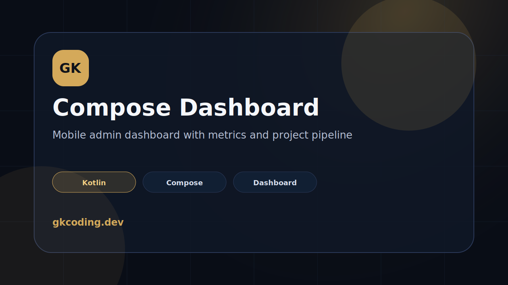

# GK Compose Admin Dashboard



Jetpack Compose admin dashboard sample by **GK Coding**.

This project demonstrates a clean Android dashboard UI for tracking project requests, active builds, and delivery status.

## Features

- Kotlin Android app
- Jetpack Compose UI
- Material 3 dark premium theme
- Dashboard metrics
- Project pipeline list
- Clean small-project architecture

## Tech

`Kotlin` · `Jetpack Compose` · `Material 3` · `Android Studio`

## Verify

```bash
./gradlew :app:assembleDebug
```

## Purpose

Portfolio/demo project showing Android dashboard UI implementation and product-oriented information hierarchy.
